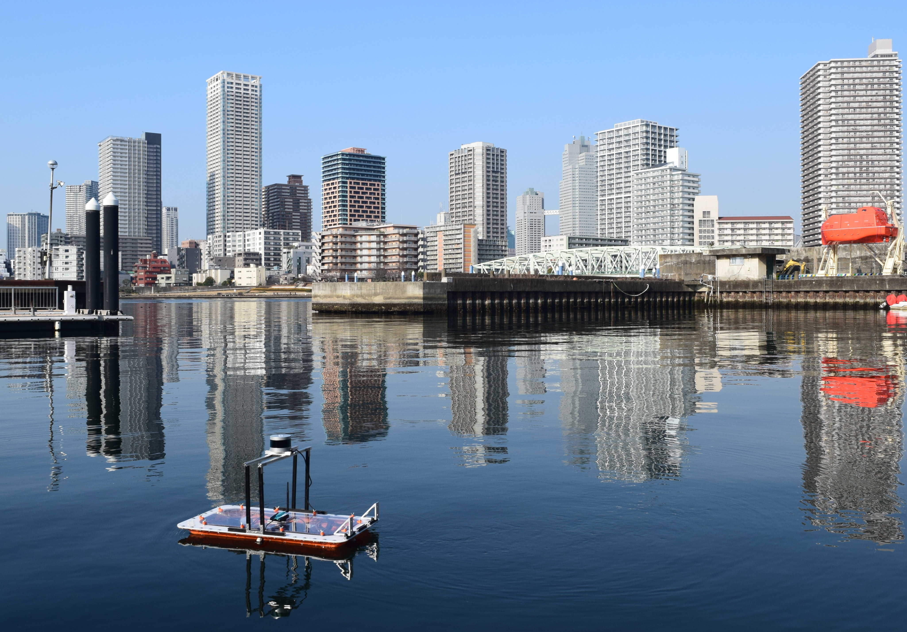

I was part of the roboat project for my Master's research. Below are some of my favorite pictures and demos from my work on the project. You can learn more about roboat at [roboat.org](https://roboat.org/). papers, thesis and such are on [Google Scholar](https://scholar.google.com/citations?user=IMYHqlIAAAAJ&hl=en).

 <i>Sailing the 1:4 scale Roboat in the Tokyo harbor for a demo</i> 

  
  

<iframe width="560" height="315" src="https://www.youtube.com/embed/cIztPAkAGsA?si=vuS-dl-JcEeK4fy8&amp;start=456" title="YouTube video player" frameborder="0" allow="accelerometer; autoplay; clipboard-write; encrypted-media; gyroscope; picture-in-picture; web-share" referrerpolicy="strict-origin-when-cross-origin" allowfullscreen></iframe>

<i>demo for dutch media</i>

  
  

<iframe width="560" height="315" src="https://www.youtube.com/embed/9JNuBHQdF0U?si=p_1PtIEpG2w7EeMQ" title="YouTube video player" frameborder="0" allow="accelerometer; autoplay; clipboard-write; encrypted-media; gyroscope; picture-in-picture; web-share" referrerpolicy="strict-origin-when-cross-origin" allowfullscreen></iframe>

<i>"Shapeshifting" Autonomous Boats: demo from my thesis work </i>
